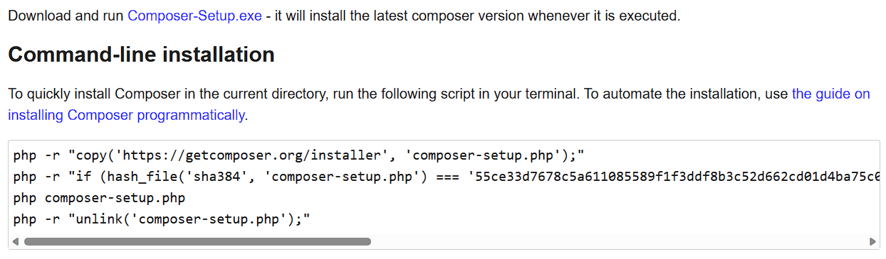
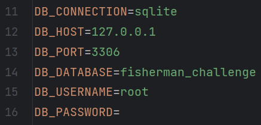

# How to run it

## Requirements

* First you need to install PHP, the installation depends on the OS is being used
* After that is necessary to install composer running the command provided on their page [getcomposer.org](https://getcomposer.org/download/), if we are running on windows we need to download and install the exe instead of running the command 
* When installing with the exe on windows don't forget to check to add the PHP exe to the path
* Then after cloning the repository is necessary to install all the packages needed to run it. This can be done by running the next command in the same dir as the project
``composer install``
* Also because the project is running on Vue.JS is necessary to install all the necessary packages with
``npm install``
* After installing all the necessary packages we need to make a copy of the file '.env.example' and paste it as '.env', usually this can be done with the following command
``cp .env.example .env``
* Then we just run the next command to make it generate a key
``php artisan key:generate``
* After that we set on '.env' the settings we want, usually we just need to set the type of database we want to use and the credentials. Is recommended to just use 'sqlite' as is easier

* Finally, we just need to run the migrations with the following command
``php artisan migrate``
* If it is the second time running the migrations is recommended to run the following command instead
``php artisan migrate:fresh``

## Serving the project

* Now is time to serve the project, we need to run the following commands at the same time
``php artisan serve`` & ``npm run dev``
* We follow the link given by the 'artisan serve' command. If we instead follow the one by NPM it will tell us that is just for serving the frontend and is not the link you want to open
